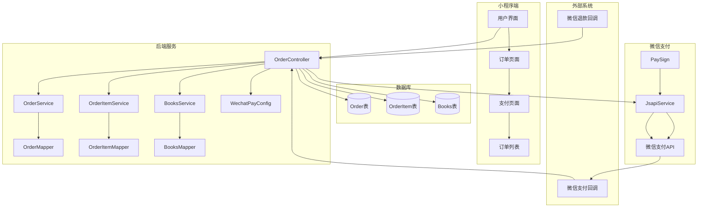

# 微信小程序下单系统架构说明

## 系统架构图



## 核心组件说明

### 1. 控制器层 (Controller)
- **OrderController**: 订单相关接口的入口
- 负责参数校验、业务逻辑调用、响应返回
- 添加了事务管理和异常处理

### 2. 服务层 (Service)
- **OrderService**: 订单业务逻辑
- **OrderItemService**: 订单项业务逻辑
- **BooksService**: 书籍业务逻辑
- 提供数据访问和业务处理能力

### 3. 数据访问层 (Mapper)
- **OrderMapper**: 订单数据访问
- **OrderItemMapper**: 订单项数据访问
- **BooksMapper**: 书籍数据访问
- 基于MyBatis-Plus实现

### 4. 配置层 (Config)
- **WechatPayConfig**: 微信支付配置
- 管理微信支付相关参数和Bean

### 5. 工具类 (Common)
- **PaySign**: 微信支付签名生成
- **R**: 统一响应格式

## 数据流程

### 下单流程
1. 用户在小程序选择商品
2. 调用 `/appoint/create` 接口
3. 校验参数和库存
4. 创建订单和订单项
5. 调用微信支付API
6. 返回支付参数给小程序
7. 小程序调起微信支付

### 支付回调流程
1. 用户完成支付
2. 微信调用 `/appoint/notify` 接口
3. 验证支付结果
4. 更新订单状态
5. 扣减库存
6. 返回成功响应

### 退款流程
1. 用户申请退款
2. 调用 `/appoint/refund/apply` 接口
3. 更新订单状态为申请退款
4. 管理员审核后调用 `/appoint/refund/execute`
5. 调用微信退款API
6. 微信回调更新订单状态
7. 恢复库存

## 优化点

### 1. 代码结构优化
- 将大方法拆分为小方法，提高可读性
- 添加详细的注释和文档
- 使用设计模式提高代码复用性

### 2. 异常处理优化
- 添加全局异常处理
- 详细的错误日志记录
- 友好的错误信息返回

### 3. 事务管理
- 关键操作添加事务注解
- 确保数据一致性
- 异常时自动回滚

### 4. 业务逻辑完善
- 添加库存校验
- 添加书籍存在性校验
- 添加参数格式校验

### 5. 安全性增强
- 微信支付签名验证
- 参数校验和过滤
- 敏感信息保护

## 技术栈

- **后端框架**: Spring Boot 2.x
- **数据库**: MySQL 8.0
- **ORM框架**: MyBatis-Plus
- **支付SDK**: 微信支付Java SDK
- **日志框架**: Logback
- **构建工具**: Maven

## 部署说明

### 环境要求
- JDK 8+
- MySQL 8.0+
- Maven 3.6+

### 配置项
```yaml
# 数据库配置
spring:
  datasource:
    url: jdbc:mysql://localhost:3306/bookstore
    username: root
    password: password
    driver-class-name: com.mysql.cj.jdbc.Driver

# 微信支付配置
wxpay:
  appid: 你的小程序appid
  mch-id: 你的商户号
  mch-serial-no: 证书序列号
  mch-private-key-file-path: classpath:apiclient_key.pem
  api-v3-key: 你的APIv3密钥
  notify-url: https://your-domain.com/appoint/notify
```

### 启动步骤
1. 创建数据库和表
2. 配置微信支付参数
3. 启动应用
4. 配置微信支付回调地址

---

**作者：** tangxin  
**更新时间：** 2024-01-01
