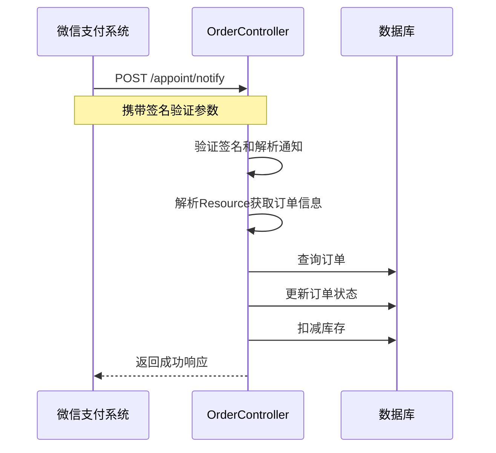
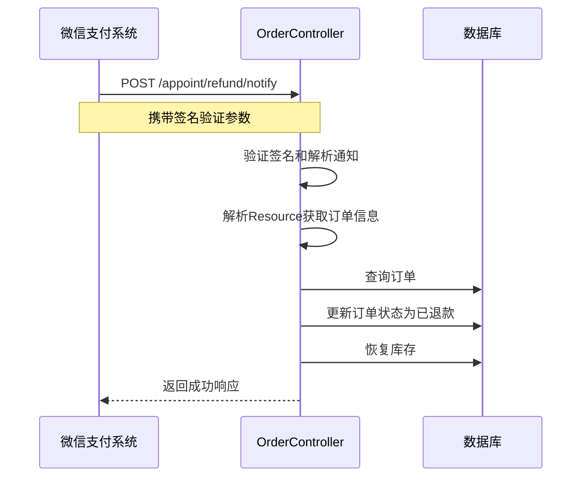

# 微信支付接口错误修复说明

## 修复的问题

### 1. NotificationParser 使用错误

**问题描述：**
- `Cannot resolve method 'getOutTradeNo' in 'Resource'`
- `Cannot resolve method 'getTransactionId' in 'Resource'`
- `NotificationParser parser = new NotificationParser(wechatPayConfig.wechatPayConfig())` 报错

**原因分析：**
微信支付 Java SDK 的 NotificationParser 需要正确的参数构造，并且 Resource 对象的方法调用方式在新版本中有所变化。

**修复方案：**

#### 1.1 修复 NotificationParser 构造
```java
// 修复前
NotificationParser parser = new NotificationParser(wechatPayConfig.wechatPayConfig());
Notification notification = parser.parse(notifyData, Notification.class);

// 修复后
NotificationParser parser = new NotificationParser(wechatPayConfig.wechatPayConfig());
RequestParam requestParam = new RequestParam.Builder()
        .serialNumber(serial)
        .nonce(nonce)
        .signature(signature)
        .timestamp(timestamp)
        .body(notifyData)
        .build();

Notification notification = parser.parse(requestParam);
```

#### 1.2 修复 Resource 方法调用
```java
// 修复前
String outTradeNo = notification.getResource().getOutTradeNo();
String transactionId = notification.getResource().getTransactionId();

// 修复后
String resourceJson = notification.getResource().toString();
ObjectMapper mapper = new ObjectMapper();
JsonNode resourceNode = mapper.readTree(resourceJson);

String outTradeNo = resourceNode.get("out_trade_no").asText();
String transactionId = resourceNode.get("transaction_id").asText();
```

### 2. 回调接口参数修复

**问题描述：**
回调接口需要接收微信支付系统传递的签名验证参数。

**修复方案：**
```java
// 修复前
public String payNotify(@RequestBody String notifyData)

// 修复后
public String payNotify(@RequestBody String notifyData,
                       @RequestHeader("Wechatpay-Signature") String signature,
                       @RequestHeader("Wechatpay-Timestamp") String timestamp,
                       @RequestHeader("Wechatpay-Nonce") String nonce,
                       @RequestHeader("Wechatpay-Serial") String serial)
```

### 3. 添加必要的导入

**新增导入：**
```java
import com.wechat.pay.java.core.notification.RequestParam;
import com.fasterxml.jackson.databind.ObjectMapper;
import com.fasterxml.jackson.databind.JsonNode;
```

## 修复后的完整流程

### 支付回调处理流程



### 退款回调处理流程



## 关键改进点

### 1. 安全性增强
- 添加了微信支付签名验证
- 使用 RequestParam 正确构造验证参数
- 确保回调请求的真实性

### 2. 数据解析优化
- 使用 Jackson 解析 Resource JSON 数据
- 正确处理微信支付 API v3 的数据格式
- 提供更稳定的数据访问方式

### 3. 错误处理完善
- 添加了详细的异常处理
- 提供友好的错误日志
- 确保回调处理的稳定性

## 测试建议

### 1. 单元测试
```java
@Test
public void testPayNotify() {
    // 测试支付回调处理
    String notifyData = "{\"resource\":{\"out_trade_no\":\"test123\"}}";
    String result = orderController.payNotify(notifyData, "signature", "timestamp", "nonce", "serial");
    assertEquals("{\"code\":\"SUCCESS\",\"message\":\"成功\"}", result);
}
```

### 2. 集成测试
- 使用微信支付沙箱环境测试
- 验证完整的支付流程
- 测试异常情况处理

### 3. 生产环境验证
- 监控回调接口的调用情况
- 检查订单状态更新是否正确
- 验证库存扣减是否正常

## 注意事项

1. **依赖版本**：确保使用最新版本的微信支付 Java SDK
2. **Jackson 依赖**：确保项目中包含 Jackson 依赖
3. **签名验证**：生产环境中必须验证微信支付签名
4. **日志监控**：关注回调处理的日志，及时发现问题

---

**修复时间：** 2024-01-01  
**修复人员：** tangxin  
**版本：** v1.0.1
